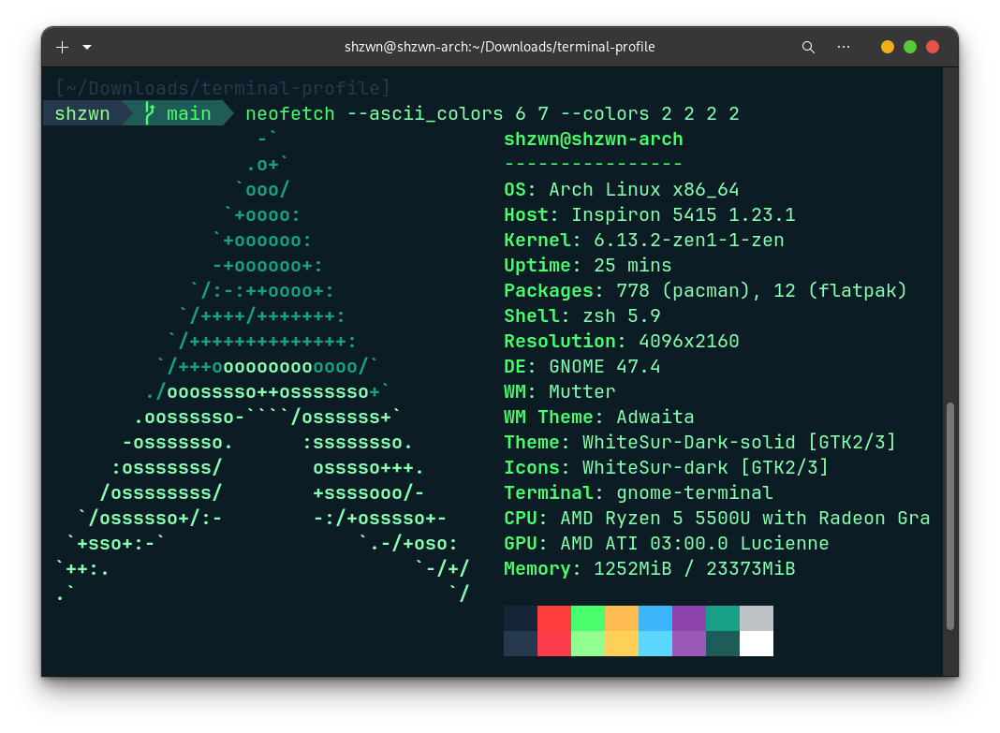

# Pixegami Terminal Profile



This is my profile for my gnome-terminal on Arch. Forked from Pixegami repo's.
app.

# Prerequisites

For the scripts to work, I think these are the bare minimum requirements.

```bash
# Update your software repositories.
sudo pacman -Syu

# Install Git.
sudo pacman -S --noconfirm git

```

# Installation


### ZSH, OhMyZSH and Plugins

The shell that I use is "ZSH", with the OhMyZSH upgrade on top of that. To install all of that stuff,
you can run the helper script (and may need to restart after).

```bash
./install_terminal.sh
```

After this, the terminal should look a bit different, but we need to do the next step to have the
entire theme.

### Profile (plugins, theme, font and color)

This script will first install two plugins that I like to use: auto-complete and color highlighting.

```bash
# You don't need to execute this - it's part of the script already.
(cd ~/.oh-my-zsh/custom/plugins && git clone https://github.com/zsh-users/zsh-syntax-highlighting)
(cd ~/.oh-my-zsh/custom/plugins && git clone https://github.com/zsh-users/zsh-autosuggestions)
```

It will also copy over the `.zshrc` and `pixegami-agnoster.zsh-theme` files for the
terminal to use (which will wire up the plugins and the theme).

The last command is to create a terminal profile that will set the colors and also set the font
to be the Powerline one we installed earlier (required for the theme to display correctly).

```bash
./install_profile.sh
```

> You can also change the font to any of the other [Powerline Patched Fonts](https://github.com/powerline/fonts) too if you don't like RobotoMono.

If it looks funky after this command, then you might need to wait until the theme is updated with a
Powerline font (the next step), and may need to also restart your machine.


## Notes

How to dump current terminal profiles.

```bash
dconf dump /org/gnome/terminal/legacy/profiles:/ > gnome-terminal-profiles.dconf
```

How to display terminal information (I use [Neofetch](https://github.com/dylanaraps/neofetch)).

```bash
sudo pacman -S --noconfirm neofetch

# Display the profile
# I override the colors because the default red is kinda ugly in this theme.
neofetch --ascii_colors 6 7 --colors 2 2 2 2
```

## Sources

Here are some of the main resources I used as part of this terminal setup.

[Oh My Zsh!](https://medium.com/wearetheledger/oh-my-zsh-made-for-cli-lovers-installation-guide-3131ca5491fb) | [Robby Russel OMZ](https://github.com/robbyrussell/oh-my-zsh) | [Install Powerline](https://askubuntu.com/questions/283908/how-can-i-install-and-use-powerline-plugin) | [Powerline Patched Fonts](https://github.com/powerline/fonts)
| [Agnoster Theme](https://gist.github.com/3712874)

